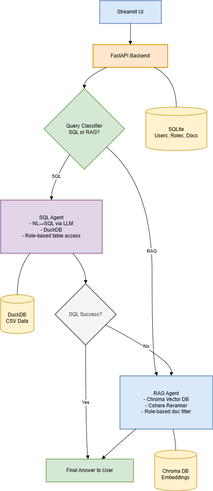

# AxiomInsight

A role-scoped question-answering service over a small set of internal company
documents. It routes each question to one of two backends — SQL over DuckDB for
tabular data, or vector retrieval over Chroma for prose — and restricts what a
user can see to their own department's documents plus anything marked general.

This is a personal project and a prototype, not production software.

---

## What it actually does

1. **Classifies the question.** An LLM call decides whether the question is
   answerable from tabular data (`SQL`) or from documents (`RAG`). Results are
   memoised with `lru_cache`.
2. **Routes it.**
   - *SQL path:* the schema of the tables the user's role may read is put in a
     prompt, the model writes a `SELECT`, the query is validated and executed
     against DuckDB, and the rows come back as a Markdown table.
   - *RAG path:* the question is embedded and searched against Chroma with a
     role filter applied inside the query, optionally reranked by Cohere, and
     the retrieved chunks are passed to the answer model.
3. **Falls back.** If the SQL path errors or returns nothing, the question is
   retried against the document path.

Authentication is HTTP Basic against a SQLite user table, with bcrypt-hashed
passwords. The role used for filtering always comes from the authenticated
user, never from the request body.

---

## Architecture



The role used for filtering is taken from the authenticated user at the FastAPI
layer and threaded through both paths. The final answer is returned as a
complete JSON response — it is not streamed.

**Storage**

| Store  | Holds                                          |
|--------|------------------------------------------------|
| SQLite | users, roles, document registry                |
| Chroma | embedded markdown chunks, tagged with a role   |
| DuckDB | tables loaded from uploaded CSVs, plus a `tables_metadata` role map |

---

## Role-based access control

Roles: `Admin`, `Finance`, `HR`, `Marketing`, `Engineering`, `Compliance`,
`General`. Admin sees everything; every other role sees its own documents plus
`General`.

**On the document path, the role filter is a pre-filter.** It is passed to
Chroma as a `where` clause on the query, so restricted chunks are never scored
and never enter the candidate set:

```python
# app/rag_utils/rag_module.py
search_kwargs = {"k": k, "filter": {"role": {"$in": [user_role, "general"]}}}
vectorstore.as_retriever(search_kwargs=search_kwargs, search_type="similarity")
```

The difference matters: a post-filter would fetch the global top-k and then
discard what the user may not see, which both leaks through ranking side
effects and silently shrinks the result set.

**On the SQL path**, the schema handed to the model is scoped to the role's
tables before the prompt is built, and the generated SQL is re-checked against
that same allowlist afterwards. The query is also rejected unless it begins
with `SELECT` and contains no DDL/DML keywords.

---

## Vector store backends

Retrieval goes through a `VectorStoreBackend` interface rather than talking to
a store directly, selected with one environment variable:

```bash
VECTOR_STORE=chroma      # default
VECTOR_STORE=pinecone
```

The interface exists because the two stores disagree on more than construction:
each has its own metadata-filter dialect. Chroma accepts a bare equality map for
a single condition; Pinecone wants an explicit operator.

```python
ChromaBackend.role_filter("general")    # {"role": "general"}
PineconeBackend.role_filter("general")  # {"role": {"$eq": "general"}}
```

Hardcoding either dialect would silently break the other store, so each backend
owns its own — which is what keeps the role pre-filter correct regardless of
which store is behind it.

**Chroma is the default and the backend this project is developed against.** It
is embedded, so the app runs from a clone with no external account, which is
the main reason it is the default. Pinecone is there for when the index needs to
outlive the process; its client libraries are optional:

```bash
pip install -r requirements-pinecone.txt
```

---

## Setup

Requires Python 3.11+ and an OpenAI API key.

```bash
git clone https://github.com/NilkanthSuthar/AxiomInsight.git
cd AxiomInsight

python3 -m venv venv && source venv/bin/activate    # Windows: venv\Scripts\activate
pip install -r requirements.txt

cp .env.example .env        # add your OPENAI_API_KEY
python -m scripts.seed      # creates roles, an admin user, loads + indexes sample docs
```

Then, in two terminals:

```bash
uvicorn app.main:app --port 8000     # API
streamlit run app/ui.py              # UI at http://localhost:8501
```

Default login is `admin` / `admin123` (override with `ADMIN_USERNAME` /
`ADMIN_PASSWORD` before seeding).

### Without an API key

The app starts, the UI loads, and you can log in. `GET /health` reports what is
configured:

```json
{"status":"ok","openai_key_configured":false,"cohere_reranking_enabled":false}
```

Asking a question returns HTTP 503 with instructions rather than a stack trace.
`python -m scripts.seed` still registers documents and loads CSVs into DuckDB;
re-run it after adding a key to build the vector index.

### Sample data

`static/uploads/` contains eight synthetic documents across the six
departments — financial and marketing reports, an engineering architecture
document, an employee handbook, a compliance policy (all `.md`), and one HR
CSV of 49 fictional employees. `scripts/seed.py` registers and indexes them.
None of it is real company data.

---

## API

| Endpoint | Auth | Purpose |
|---|---|---|
| `GET /health` | none | Readiness and which integrations are configured |
| `GET /login` | any user | Verify credentials, return role |
| `GET /roles` | any user | List roles |
| `POST /chat` | any user | Ask a question |
| `POST /create-user` | Admin | Create a user |
| `POST /create-role` | Admin | Create a role |
| `POST /upload-docs` | Admin | Upload and index a `.md` or `.csv` |

```bash
curl -u admin:admin123 -X POST http://localhost:8000/chat \
  -H 'Content-Type: application/json' \
  -d '{"question":"What is the parental leave policy?"}'
```

---

## Tech stack

| | |
|---|---|
| API | FastAPI, Uvicorn |
| UI | Streamlit |
| Orchestration | LangChain (LCEL), pinned to the 0.3 line |
| Vector store | Chroma (default) or Pinecone, behind one interface; `text-embedding-3-small` |
| Analytics | DuckDB |
| Auth store | SQLite, bcrypt |
| Models | OpenAI `gpt-4o-mini` (routing, NL→SQL), `gpt-4o` (answers) |
| Reranking | Cohere `rerank-english-v3.0` (optional) |
| Tracing | LangSmith (optional, off by default) |

Every dependency in `requirements.txt` is pinned.

---

## Observability

LangSmith tracing is off by default and enabled by setting both:

```bash
LANGCHAIN_TRACING_V2=true
LANGCHAIN_API_KEY=...
```

Each retrieval run is tagged with the role that scoped it, whether reranking was
in the path, and which vector store served it, so traces can be filtered by
department or configuration rather than arriving as an undifferentiated list.
`GET /health` reports whether tracing is enabled, disabled, or requested without
a key.

---

## Evaluating retrieval

```bash
python -m scripts.seed                    # index the documents first
python -m scripts.evaluate_retrieval      # add --k 5, --show-misses, --json out.json
```

Measures **recall@k** and **MRR** over `eval/golden_set.json`, with and without
Cohere reranking, and prints the difference between the two. The golden set is
26 questions, each with exactly one relevant source document; the facts were
taken from the sample documents and every label was checked against the file it
points at. Several Finance and Marketing questions are answerable only by one of
two similar documents (annual versus quarterly), which is where reranking has a
chance to matter.

Since there is one relevant document per question, recall@k is the hit rate at k.

Reranking is only measured when `COHERE_API_KEY` is set; otherwise the script
reports the baseline alone and says so.

**No number from this script is quoted in this README.** Run it against your own
index and the output is the result.

---

## Tests

```bash
pytest
```

90 tests, none of which need an API key — they use a deterministic bag-of-words
embedder in place of OpenAI.

| Area | Covers |
|---|---|
| Vector-store backends | selection, the two filter dialects, optional-dependency errors |
| Role scoping (vector) | each role's visibility, and that the filter is a pre-filter |
| Role scoping (SQL) | allowed tables, schema scoped before the prompt, cross-role refusal |
| HTTP layer | anonymous rejection, Admin-only routes, upload validation, traversal |
| Evaluation | metric arithmetic, golden-set integrity, pipeline invariants |

---

## Project layout

```
app/
  config.py              env-based settings, paths, credential checks
  vectorstores.py        VectorStoreBackend interface: Chroma and Pinecone
  main.py                FastAPI app: auth, RBAC, routes
  ui.py                  Streamlit client
  rag_utils/
    rag_module.py        indexing, role-filtered retriever, LCEL chain
    rag_chain.py         async wrapper over the chain
    query_classifier.py  SQL-vs-RAG routing
    csv_query.py         NL→SQL, validation, DuckDB execution
scripts/
  seed.py                bootstrap roles, admin user, sample documents
  evaluate_retrieval.py  recall@k and MRR, with and without reranking
eval/
  golden_set.json        26 questions with their relevant source document
  metrics.py             recall@k, MRR
tests/                   pytest suite, no API key required
static/uploads/          sample documents, one directory per role
```

`roles_docs.db`, `chroma_db/` and `static/data/` are generated at runtime and
are not tracked.

---

## License

MIT — see [LICENSE](LICENSE).
